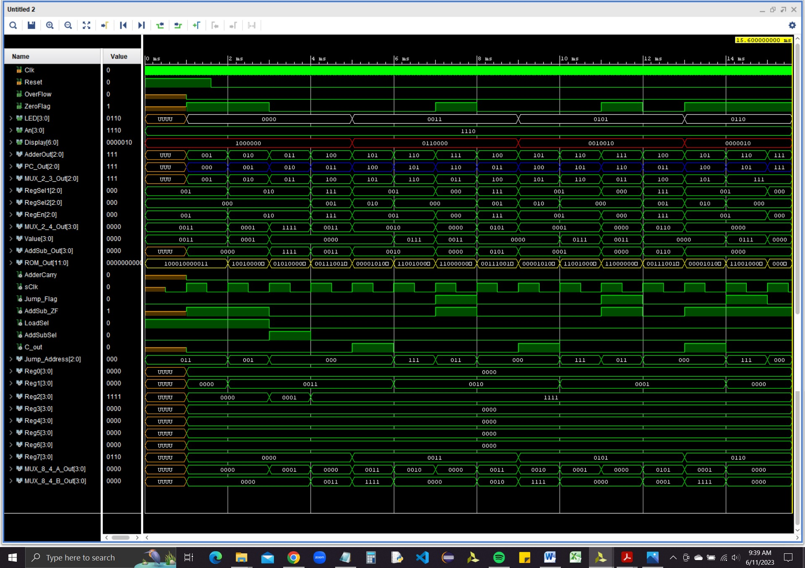

# NanoProcessor

4 bit arithmetic unit capable of completing simple pperations on signed integers
Made on Vivado simulation using Basys 3 board

## Components
- Half Adder
- Full Adder
- 3 Bit Adder
- 4 Bit Addition Substraction Unit
- 2 to 4 Decoder
- 3 to 8 Decoder
- Register
- Register Bank
- 2 Way 3 Bit Multiplexer
- 2 Way 4 Bit Multiplexer
- 8 way 4 bit Multiplexer
- D Flip Flop
- Program Counter
- Slow Clock
- 7 Segment Display Look Up Table
- Program ROM
- Instruction Decoder
- 4 Bit Processor

Example Assembly program mentioned below

0 –   MOVI R1 3   10 001 000 0011

1 –   MOVI R2 1   10 010 000 0001

2 –   NEG R2      01 010 000 0000

3 –   ADD R7 R1   00 111 001 0000

4 –   ADD R1 R2   00 001 010 0000

5 –   JZR R1 7    11 001 000 0111

6 –   JZR R0 3    11 000 000 0011

7 –      -        00 000 000 0000

For the above code runtime is as below

